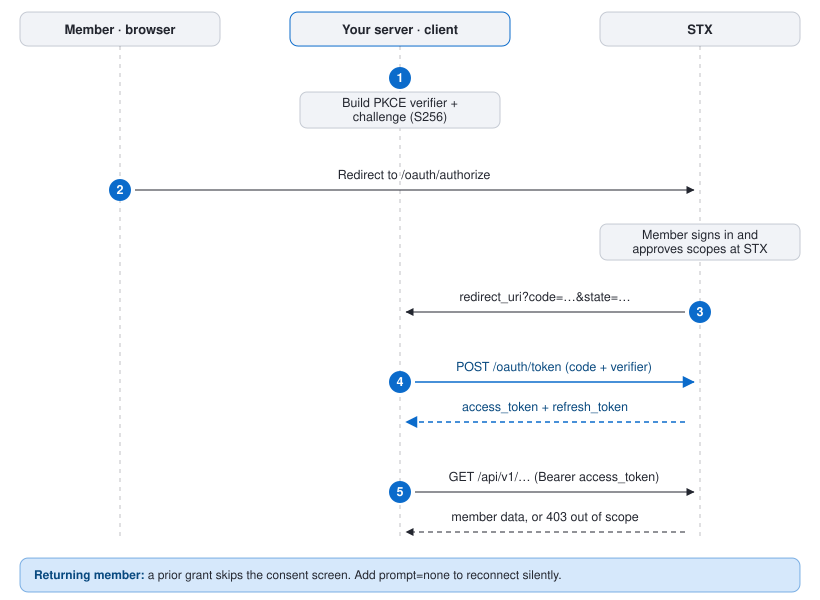

# STX demo apps: Sideline and Playbook

> **Sideline and Playbook are demo apps. They are fictional sports apps that exist only to show how to build on STX. They are not real products or companies.**

**Try them:**

- **[Sideline demo app](https://sideline.sportsxapp.com)**: an app with its own accounts. Its users log in to it as they do today, then link their STX account once.
- **[Playbook demo app](https://playbook.sportsxapp.com)**: an app with no login of its own. People register or log in with their STX account.

Both are this one codebase, a small sports demo app built on the STX Exchange, run in a different **login mode**. Each mode is a different answer to the same question: how do the people using your app get to trade on STX from it?

Once someone is in, the demo app is the same in every mode. It reads the member's balance, positions and orders, places and cancels orders from a betslip, streams their live account data, shows public market data on the app's own token, and unlinks on request. It never holds STX funds, no scope can move money, and the browser never sees an STX token.

This repo is the demo, not the manual. How working with a member's STX account works (the flow, scopes, tokens, errors) is in the [STX docs](https://docs.stxapp.io/oauth/). What is here is what is specific to this app: the modes, how to set up and run each, its settings, its tests, and where in the code each step lives. Every call the backend makes to STX is also listed on the running app's **API calls** page, with the SDK call behind it and a redacted request and response.

## Login modes

Set `LOGIN_MODE` and the same code becomes a different demo app. Each mode's code is in its own folder behind one small switch ([`backend/src/login/index.ts`](node-react/backend/src/login/index.ts), [`frontend/src/login/index.tsx`](node-react/frontend/src/login/index.tsx)), so you can read only the one you need.

| `LOGIN_MODE` | Your situation, and what your users do | Demo app | Files to read |
| --- | --- | --- | --- |
| `own` | **You have an app with its own accounts.** Your users log in to your app as they do today, then link their STX account once. `OWN_LOGIN` picks the login this demo uses: `privy` or `mock`. | [Sideline demo app](https://sideline.sportsxapp.com) | [`backend/src/login/own/`](node-react/backend/src/login/own/), [`backend/src/login/link.ts`](node-react/backend/src/login/link.ts), [`frontend/src/login/own/`](node-react/frontend/src/login/own/) |
| `stx` | **You're building a new app with no login yet.** People register or log in with their STX account. | [Playbook demo app](https://playbook.sportsxapp.com) | [`backend/src/login/stx/`](node-react/backend/src/login/stx/), [`frontend/src/login/stx/`](node-react/frontend/src/login/stx/) |
| `vendor` | **You use a login service like Auth0 or Clerk.** Keep your login and link STX accounts (that is `own`), or add STX as a login option in the service: your users choose STX on your login screen, next to Google or Apple. This mode is the second. | Not deployed yet | [`backend/src/login/vendor/`](node-react/backend/src/login/vendor/), [`backend/src/login/link.ts`](node-react/backend/src/login/link.ts), [`frontend/src/login/vendor/`](node-react/frontend/src/login/vendor/) |

The three situations, their titles and the one line under each are the ones the [STX docs](https://docs.stxapp.io/oauth/) start from.

**About Privy in `own` mode.** Privy is only what this demo happens to use for a real login. It is not a requirement and STX has no relationship to it. The app's login and the STX link are two separate steps: your login decides which of your users is making the request, and the link step attaches an STX grant to that user. Any login system works the same way (your own passwords, sessions from your framework, passkeys, a single sign-on product). To use yours, replace the one route in [`login/own/privy.ts`](node-react/backend/src/login/own/privy.ts) that turns a login into "this request is from user X"; [`login/link.ts`](node-react/backend/src/login/link.ts) does not change. `OWN_LOGIN=mock` is that same shape with no login at all, so the demo runs with nothing but STX credentials.

## How it fits together

<picture>
  <source media="(prefers-color-scheme: dark)" srcset="docs/oauth-flow-dark.svg">
  
</picture>

- The **browser** talks only to the app's backend, with an opaque session cookie.
- The **backend** holds the `client_secret` and every STX token. It runs the login mode's flow, calls STX through the [STX TypeScript SDK](https://docs.stxapp.io/sdks/typescript/), opens the STX sockets, and relays live data to the browser over Server-Sent Events.
- **STX** hosts its own login, sign-up and consent pages, and the API. The member's STX password is only ever typed at STX.

The flow itself is described in the STX docs: [overview](https://docs.stxapp.io/oauth/), [authorization code flow](https://docs.stxapp.io/oauth/authorization-flow/), [scopes](https://docs.stxapp.io/oauth/scopes/), [tokens and security](https://docs.stxapp.io/oauth/tokens-and-security/), [discovery and errors](https://docs.stxapp.io/oauth/discovery-and-errors/). To follow it in this code, [`docs/oauth-flow.md`](docs/oauth-flow.md) maps each step to its file and SDK call.

## Get sandbox access

Every mode needs an STX client (a client id and a client secret) on a sandbox exchange, and a sandbox member account to try it with. They come with your STX invite, along with the sandbox host to use as `STX_BASE_URL`; the [ISV program](https://docs.stxapp.io/isv/) page says how to get one, and [Environments](https://docs.stxapp.io/environments/) lists the hosts.

Tell us which redirect URIs to register on your client; each mode's setup below says which it needs. STX matches them exactly. All modes ask for the member scopes `profile.read balance.read portfolio.read orders.read orders.write` and the app scope `market_data`; `stx` mode also needs `openid`. What each scope allows is on the [Scopes](https://docs.stxapp.io/oauth/scopes/) page.

## Set up and run a mode

Requirements: [Bun](https://bun.sh) 1.1 or later (or Docker).

The first steps are the same for every mode:

```bash
cd node-react
cp .env.example .env
```

In `.env`, set `STX_BASE_URL`, `CLIENT_ID` and `CLIENT_SECRET` from your STX invite. Then follow the steps for your mode, and [start the app](#start-the-app).

<a name="mode-own-your-own-login-then-link-an-stx-account"></a>

### You have an app with its own accounts (`own`)

Your users log in to your app as they do today, then link their STX account once.

**Register with STX:** the redirect URI `http://localhost:8787/callback` on your client (deployed: `<PUBLIC_URL>/callback`).

**With the mock login** (nothing else to sign up for):

```bash
LOGIN_MODE=own
OWN_LOGIN=mock
REDIRECT_URI=http://localhost:8787/callback
```

**With Privy** (a real login; see the note on Privy above):

1. Create an app at [privy.io](https://privy.io). Enable the email, Google and X login methods, and add `http://localhost:5173` to its allowed origins.
2. Set:

```bash
LOGIN_MODE=own
OWN_LOGIN=privy
PRIVY_APP_ID=<from the Privy dashboard>
PRIVY_APP_SECRET=<from the Privy dashboard>
REDIRECT_URI=http://localhost:8787/callback
```

**What you will see:**

1. **Sign in to Sideline** with the mock login (a name, no password) or with Privy.
2. Open a game and tap a market. The **betslip** opens and offers **Connect your STX account**: STX opens in a popup, you log in there and allow the app, and the backend exchanges the code for tokens **server-side**. With Privy, the link step starts by itself after your first sign-in and goes straight to the same sign-in method you used.
3. Linked, the betslip places orders on STX and the wallet shows your STX balance live.
4. **Disconnect STX account** in the account menu (your avatar, top right) unlinks: it revokes the grant at STX. Signing out and back in with Privy brings your wallet and STX link back; a mock user is removed on sign-out.

<a name="mode-stx-register-or-log-in-with-an-stx-account"></a>

### You're building a new app with no login yet (`stx`)

People register or log in with their STX account. One step logs them in to your app and links their account.

**Register with STX:** the redirect URI `http://localhost:8787/auth/stx/callback` on your client (deployed: `<PUBLIC_URL>/auth/stx/callback`), and the `openid` scope.

```bash
LOGIN_MODE=stx
STX_LOGIN_REDIRECT_URI=http://localhost:8787/auth/stx/callback
# Optional: run as Playbook, the name this mode is deployed under.
APP_ID=playbook
APP_NAME=Playbook
```

**What you will see:**

1. The sign-in card has **Continue with your STX account**, which opens STX's own page: log in with email and password, or register. Below it, **Continue with Google / Apple / X** are shortcuts through STX straight to that sign-in method.
2. A new member sets up their STX account there (details, identity checks, terms), once, and allows the app. An existing member just allows it.
3. You come back signed in and linked, in one step. The app's user is keyed on the member's stable STX id for your app (the ID token's `sub`), never on their email.
4. Signing out keeps the account and its STX link, so the next login lands straight back in. If the STX link ends (you unlink, or revoke the app at STX), the app shows **Reconnect STX**, which is the same login again.

<a name="mode-vendor-a-login-service-that-offers-stx"></a>

### You use a login service like Auth0 or Clerk (`vendor`)

If your app's login runs on a service such as Auth0, Clerk, Okta or Amazon Cognito, you have two choices:

| | Keep your login, link STX accounts | Add STX as a login option in the service |
| --- | --- | --- |
| Your users | Log in as they do today, then link their STX account once | Choose STX on your login screen, next to Google or Apple |
| Set up in the login service | Nothing | A custom OpenID Connect connection |
| Who talks to STX | Your server | The login service |
| In this demo | `LOGIN_MODE=own`, above | `LOGIN_MODE=vendor`, the rest of this section |

If your app trades or reads account data for its users, the first choice is the simpler one: your server holds the STX tokens, and nothing depends on what the login service passes on. This demo app trades, so in `vendor` mode it also links the STX account after the service has logged the person in.

There are two registrations here, because two things talk to STX: the login service (to log people in with their STX account) and your app (to trade for them).

**In your login service's dashboard:**

1. Create an application for this app. Note its issuer URL, client id and client secret, and register the redirect URI `http://localhost:8787/auth/vendor/callback` (deployed: `<PUBLIC_URL>/auth/vendor/callback`).
2. Add STX as a login option. Services call this a custom, generic or enterprise OpenID Connect connection. Give it your STX sandbox host as the issuer (the service reads `<STX_BASE_URL>/.well-known/openid-configuration` from it), an STX client id and secret, and the scopes `openid email`. The service shows you a callback URL of its own for that connection.

**Register with STX:**

- the login service's callback URL from step 2, on the STX client you gave the service, with the `openid` scope;
- `http://localhost:8787/callback` on your app's STX client (deployed: `<PUBLIC_URL>/callback`), for the link step.

These can be one STX client with both redirect URIs, or two.

```bash
LOGIN_MODE=vendor
VENDOR_NAME=<the service's name, for the button>
VENDOR_ISSUER=https://<your tenant at the login service>
VENDOR_CLIENT_ID=<from the login service>
VENDOR_CLIENT_SECRET=<from the login service>
VENDOR_REDIRECT_URI=http://localhost:8787/auth/vendor/callback
REDIRECT_URI=http://localhost:8787/callback
# Optional. Some services take a parameter that skips their list and goes
# straight to one login option:
# VENDOR_AUTHORIZE_PARAMS=connection=<your STX connection's name>
# Optional. If the service wants the secret as a form field:
# VENDOR_CLIENT_AUTH=client_secret_post
```

**What you will see:**

1. **Continue with (your service)** opens the service's login page. Choose STX there and log in with your STX account.
2. The service sends you back and the app signs you in, keyed on the service's id for you.
3. The service has told the app who you are, but it has not given the app permission to trade for you on STX. So the first time, the app sends you straight on to **link your STX account**. You have just logged in at STX, so there is only the app's access to allow.
4. Next time, the service login is all there is: your STX link is still there.

This mode is written against the OpenID Connect standard and tested against a standard-conforming test server, not against any one service. See [Tests](#tests) for exactly what that covers.

### Start the app

```bash
docker compose up         # backend :8787, frontend :5173
```

or, without Docker:

```bash
cp .env backend/.env                              # Bun loads .env from the working directory
(cd backend && bun install && bun run dev)        # backend
(cd frontend && bun install && bun run dev)       # frontend, in another shell
```

Open <http://localhost:5173>. The backend logs the mode it started in, and `GET http://localhost:8787/health` reports it.

### Deploying a mode

One image serves every mode ([`node-react/Dockerfile`](node-react/Dockerfile)): the backend serves the built frontend from the same origin, and the mode, the app's name and its icons are all read from the environment when it starts. To deploy, set `PUBLIC_URL` to the app's origin (the redirect URIs then default to it), `COOKIE_SECURE=true`, a `TOKEN_ENCRYPTION_KEY`, and the mode's settings from above. Register the deployed redirect URIs with STX (and with your login service, in `vendor` mode).

### All settings

All configuration comes from the environment; nothing host-specific is built in. [`node-react/.env.example`](node-react/.env.example) lists every setting with a comment.

| Env var | Modes | What it is |
| ------- | ----- | ---------- |
| `LOGIN_MODE` | all | `own` (default), `stx` or `vendor` |
| `STX_BASE_URL` | all | your STX sandbox host (REST, login pages, WebSocket) |
| `CLIENT_ID`, `CLIENT_SECRET` | all | your app's STX client |
| `OAUTH_SCOPES` | all | what the app asks to do for a member; `stx` mode adds `openid` itself |
| `PUBLIC_URL` | all | optional: this app's own origin when deployed; the redirect URIs below default to it |
| `OWN_LOGIN` | `own` | `privy` or `mock`; unset, `privy` when both Privy keys are set, else `mock` |
| `PRIVY_APP_ID`, `PRIVY_APP_SECRET` | `own` + `privy` | your Privy app; the id reaches the browser, the secret does not |
| `REDIRECT_URI` | `own`, `vendor` | where STX returns after linking; registered on your STX client. Default `<PUBLIC_URL>/callback` |
| `STX_LOGIN_REDIRECT_URI` | `stx` | where STX returns after login; registered on your STX client. Default `<PUBLIC_URL>/auth/stx/callback` |
| `VENDOR_ISSUER`, `VENDOR_CLIENT_ID`, `VENDOR_CLIENT_SECRET` | `vendor` | your application at the login service |
| `VENDOR_REDIRECT_URI` | `vendor` | where the login service returns; registered there. Default `<PUBLIC_URL>/auth/vendor/callback` |
| `VENDOR_NAME`, `VENDOR_SCOPES`, `VENDOR_AUTHORIZE_PARAMS`, `VENDOR_CLIENT_AUTH` | `vendor` | optional: the button's name, the scopes (default `openid profile email`), extra authorize parameters, and how the secret is sent |
| `TOKEN_ENCRYPTION_KEY` | all | optional: encrypts stored STX tokens (AES-256-GCM); 32 random bytes, base64 |
| `COOKIE_SECURE` | all | `true` when served over HTTPS |
| `STX_PUBLIC_URL` | all | optional: the exchange as the browser sees it (deposit popup, sport icons); defaults to `STX_BASE_URL` |
| `APP_ID`, `APP_NAME`, `APP_TAGLINE`, `APP_BRAND_COLOR`, `APP_WALLET_CENTS` | all | optional: the app's name, look and starting wallet. `sideline` and `playbook` have their own logos |
| `GA_MEASUREMENT_ID`, `GA_CONSENT_REQUIRED_REGIONS`, `GA_IGNORE_REFERRER_DOMAINS`, `GA_LINKED_DOMAINS` | all | optional: see [Analytics (optional)](#analytics-optional) |

## The SDK, and where each step lives

Every call the backend makes to STX goes through the STX TypeScript SDK, [`@stxapp/stx-typescript`](https://www.npmjs.com/package/@stxapp/stx-typescript). Its guide and reference are at <https://docs.stxapp.io/sdks/typescript/>; this README does not repeat them.

> **Alpha SDK.** Logging in with an STX account (`createConnect`) and the sign-in hints on `beginAuthorization` are in `0.9.0-alpha.1`, published on npm under the `alpha` tag (`npm install @stxapp/stx-typescript@alpha`). This repo pins that exact version. An alpha may change before release.

[`docs/oauth-flow.md`](docs/oauth-flow.md) is the map from each step to the file that does it and the SDK call it uses. The short version:

| Step | Code | SDK call |
| --- | --- | --- |
| The app's STX client and its two stores | [`backend/src/stx.ts`](node-react/backend/src/stx.ts) | `new OAuthClient(...)` |
| Link an STX account (`own`, `vendor`) | [`backend/src/login/link.ts`](node-react/backend/src/login/link.ts) | `beginAuthorization`, `readCallback`, `redeemAuthorization` |
| Register or log in with an STX account (`stx`) | [`backend/src/login/stx/index.ts`](node-react/backend/src/login/stx/index.ts) | `createConnect`, `connect.start`, `connect.finish` |
| Act for the member | [`backend/src/routes/api.ts`](node-react/backend/src/routes/api.ts) | `oauth.memberClient(...)`, then `balance`, `placeOrder`, `cancelOrder`, `orders`, `fills`, `settlements` |
| Live account data | [`backend/src/liveProxy.ts`](node-react/backend/src/liveProxy.ts) | `stx.websocket()`, `ws.accountView` |
| Market data on the app's own token | [`backend/src/marketCatalog.ts`](node-react/backend/src/marketCatalog.ts), [`marketProxy.ts`](node-react/backend/src/marketProxy.ts) | `oauth.appClient("market_data")` |
| Unlink | [`backend/src/routes/api.ts`](node-react/backend/src/routes/api.ts) | `oauth.unlink(...)` |

## What is specific to this demo app

- **The app has its own wallet**, held in the demo's store (SQLite) and separate from any STX balance. Seeded via `APP_WALLET_CENTS`. The header's **Deposit** adds demo funds to it (no payment). **Add funds** on the STX balance opens STX's own deposit page: members fund their STX account at STX.
- **Every mode ends the same way:** one of the app's users on the browser's session, and the member's STX tokens stored against that user. The browser only holds an opaque session cookie.
- **Who the user is.** `own` + `privy`: the Privy user id. `stx`: the member's STX id for this app, at that exchange. `vendor`: the login service's id for them. `own` + `mock`: nobody, just the browser session. A user with an account behind them keeps their wallet and STX link across sign-outs and browsers.
- **A new session at sign-in.** Signing in moves the browser to a session id made at that moment, and sign-out clears it.
- **Popups, not redirects.** STX pages open in a popup on wide screens so the member stays on the app; phones get a full-page trip and come back. If the browser blocks the popup, the app asks once more and only then offers to continue in the same tab. A window closed without finishing leaves the app as it was.
- **A member STX is still verifying.** Their calls answer `account_pending` and the app keeps their link; it works again once STX has verified them.
- **Stored tokens** are encrypted at rest when `TOKEN_ENCRYPTION_KEY` is set. Keep that key: links stored under it cannot be read with a different one, so after a change those members read as not linked and link again.
- **Unlink** revokes at STX and drops the link locally; the app's user and wallet remain, so they can link again.

## Live sports data

Everything below comes from the exchange itself, through the SDK, on the app's
own token (`client_credentials`, scope `market_data`):

| What | Where it comes from |
| ---- | ------------------- |
| Markets, teams, event status and start | `GET /api/v1/markets` (`participants`, `event_status`, `event_start`, `question`) |
| Sport icons | the exchange's `GET /api/images/categories/standard/<sport>.svg` |
| Live score and clock | the `market:<id>` channel (`ws.market()`): its join reply and `market_update` carry `event_brief`, e.g. `CHC 3 - 4 BOS : Bottom 8th 1 Outs` |
| Prices, book, trades, price history | `ticker`, `orderbook`, `trades`, `market_stats` channels |

The backend joins `market:<id>` for one market per live game (and each betslip
market), at most 12 per stream, and relays only the event status to the browser
as `brief` events (`GET /api/market-stream?topic=market`).

Teams are shown as badges of their abbreviation in a colour of their own: the
exchange serves no team or league logos (see Known limitations), and the demo loads
no images from third parties.

## Architecture

- **Backend** (`node-react/backend`, Bun + Hono): holds the app's `client_secret` and every STX token, runs the configured login mode, keeps the app's mock wallet, proxies member calls through the SDK, holds the STX sockets (the member's account view and the public market channels) and relays them to the browser over SSE, and logs every STX call. Persistence is **SQLite** behind swappable store interfaces (`src/stores.ts`).
- **Frontend** (`node-react/frontend`, Vite + React): markets and scores, the betslip, the dual wallet, the member's orders, trades and settlements, and the API calls page. It asks the backend which login mode is running and draws that mode's sign-in. The browser opens no STX socket and holds no credential.

### Where each mode's code is

```
node-react/backend/src/login/
  index.ts          the switch: LOGIN_MODE -> one mode's routes
  shared.ts         the page that ends a trip to STX; sign-in hints
  link.ts           link your STX account: GET /login, GET /callback   (own, vendor)
  own/
    index.ts        mode own: the app's login, then link.ts
    privy.ts        OWN_LOGIN=privy: POST /api/login/privy
    mock.ts         OWN_LOGIN=mock:  POST /api/login
  stx/
    index.ts        mode stx: GET /auth/stx/start, GET /auth/stx/callback
  vendor/
    index.ts        mode vendor: GET /auth/vendor/start, GET /auth/vendor/callback, then link.ts

node-react/frontend/src/login/
  index.tsx         the switch: the sign-in card for the mode the backend reports
  own/              PrivySignIn.tsx, MockSignIn.tsx
  stx/              StxSignIn.tsx (the STX button and the Google, Apple, X shortcuts)
  vendor/           VendorSignIn.tsx
```

### Store schema (`backend/src/stores.ts` over `backend/src/db.ts`)

| Table           | Keyed by            | What it holds |
| --------------- | ------------------- | ------------- |
| `users`         | `(session_id, app_id)` unique | the app's user and their own `wallet_cents`; `external_id` is who they are in the login that signed them in (null for the mock login). |
| `account_links` | `user_id`           | the STX grant linked to a user: tokens, granted scopes, `linked_at`. The only place STX tokens live. |
| `auth_flows`    | `state` (one-time)  | linking in progress: PKCE verifier and which app and user the grant links to. |
| `signin_flows`  | `state` (one-time)  | a login in progress (`stx`, `vendor`): PKCE verifier, nonce and the browser session that started it. |
| `activity`      | autoincrement       | every STX request, with the SDK call and its redacted request and response. |

### Backend routes

The same in every mode:

| Route | Purpose |
| ----- | ------- |
| `GET /health` | liveness, and the login mode this deployment runs |
| `GET /api/app` | the app profile (no secrets), the login mode, the exchange's public URL and the optional Google Analytics id |
| `GET /api/me` | the app, signed-in user (and wallet), link status |
| `POST /api/signout` | sign out of the app on this browser |
| `POST /api/unlink` | unlink STX (revoke and drop the grant), keep the user |
| `GET /api/wallet`, `POST /api/wallet/deposit` | dual wallet: app wallet, STX balance, combined; demo top-up of the app wallet |
| `GET /api/orders`, `POST /api/orders`, `POST /api/orders/batch`, `DELETE /api/orders/:id` | order proxies |
| `GET /api/trades`, `GET /api/settlements` | the member's fills and settled positions |
| `GET /api/stream` | SSE: the member's live account (balance, orders, fills, positions) |
| `GET /api/markets` | the public market catalog |
| `GET /api/markets/:id/trades` | a market's recent public trades (its `recent_trades`), which seed the trades tape and price chart; the `trades` channel only pushes new trades |
| `GET /api/market-stream?topic=` | SSE: `ticker`, `orderbook`, `trades`, `market_stats`, or `market` (live scores) |
| `GET /api/activity`, `GET /api/activity/:id/detail` | the API calls log and one call's redacted detail |

Per login mode. A route that is not part of the running mode answers `404`:

| Route | `own` + `mock` | `own` + `privy` | `stx` | `vendor` | Purpose |
| ----- | :---: | :---: | :---: | :---: | ------- |
| `POST /api/login` | yes | | | | mock sign-in (creates user and wallet) |
| `POST /api/login/privy` | | yes | | | sign in with a Privy token, verified on the server |
| `GET /login`, `GET /callback` | yes | yes | | yes | link an STX account to the signed-in user |
| `GET /auth/stx/start`, `GET /auth/stx/callback` | | | yes | | register or log in with an STX account |
| `GET /auth/vendor/start`, `GET /auth/vendor/callback` | | | | yes | log in at the login service |

## Analytics (optional)

The app can report anonymous usage to Google Analytics 4. It is off unless you set `GA_MEASUREMENT_ID` (a `G-...` id) on the backend. The id and the settings below reach the browser at runtime through `GET /api/app`, so the same build serves every environment, and a fork sends nothing unless it sets its own id.

- **On by default, with an opt-out.** With an id set there is no banner: gtag.js loads on the first visit. Consent Mode v2 denies all ads storage and grants `analytics_storage` only. The footer has an "Opt out of usage statistics" switch. Opting out is stored in `localStorage` (`sideline.analytics-consent`), sets `ga-disable-<id>`, updates consent to denied and stops all events; on later visits gtag.js is not loaded at all. "Allow usage statistics" turns it back on.
- **Regions that need consent first.** `GA_CONSENT_REQUIRED_REGIONS` (comma-separated ISO 3166 codes, e.g. `GB,CA-QC`) sets `analytics_storage` to denied by default in those regions for visitors who have not chosen, so Google receives cookieless pings only until they use the footer switch.
- **Referrers and linked domains.** `GA_IGNORE_REFERRER_DOMAINS` (comma-separated) sends `ignore_referrer: true` when the visitor arrives from one of those domains or a subdomain, so your own sites do not show up as traffic sources. `GA_LINKED_DOMAINS` (comma-separated) turns on cross-domain measurement (`linker`) for those hosts.
- **What is sent.** Page views for each view (Markets, My orders, My trades, Settlements, API calls); the landing view keeps its URL, so `utm_*` campaign tags are counted. Events: `sign_in`, `sign_in_start` (which button, never who), `link_start`, `link_success`, `link_error`, `order_place` (number of orders only), `order_cancel`, `api_calls_view`, `deposit_click` (STX deposit), `wallet_topup` (the app's wallet), `popup_blocked`, `source_click`.
- **What is never sent.** Names, emails, STX account or user ids, order ids, prices or balances.

All the `GA_*` settings are optional and empty by default. The code is `frontend/src/analytics.ts` and `frontend/src/components/AnalyticsOptOut.tsx`.

## Known limitations

Things the demo works around because the exchange does not offer them to apps today:

- **No team or league logos.** The exchange has no logo field on events,
  markets or participants and serves no team images; only per-sport icons
  (`/api/images/categories/...`). Teams are shown as abbreviation badges.
- **No structured score.** A live score exists only as preformatted text
  (`event_brief` / `detailed_event_brief`); home and away scores, period and
  clock are not separate fields on any external surface. The demo parses
  `"AWAY n - m HOME : clock"` and falls back to the text as-is.
- **No score over REST.** `GET /api/v1/markets` omits `event_brief`, there is no
  `GET /api/v1/events/:id`, and `GET /api/v1/events` (scope `events`) carries no
  brief or score. Scores are reachable only on the market channels
  (`market:<id>`, `markets`, `market_updates`, `market_info`), which an app
  token with `market_data` may join; the demo uses `market:<id>`.
- **No initial brief on the list channels.** `markets` and `market_updates`
  send only changes, and `market_info`'s full snapshot is about 10 MB, so the
  demo joins `market:<id>` per live game to get the current score on join.
- **The `events` channel carries volume only** and needs the `events` scope.

## Tests

```bash
cd node-react/backend && bun install && bun test && bunx tsc --noEmit
cd node-react/frontend && bun install && bun test && bunx tsc --noEmit && bun run build
cd node-react/backend && bun run e2e     # every login mode, end to end
```

None of this needs a network connection, an STX account or any secret, and [GitHub Actions](.github/workflows/ci.yml) runs all of it on every push and pull request, and once a day.

**Unit tests** cover each mode's routes ([`login/own/own.test.ts`](node-react/backend/src/login/own/own.test.ts), [`login/stx/stx.test.ts`](node-react/backend/src/login/stx/stx.test.ts), [`login/vendor/vendor.test.ts`](node-react/backend/src/login/vendor/vendor.test.ts)), the switch ([`login/modes.test.ts`](node-react/backend/src/login/modes.test.ts)), token refresh, revoke, and the activity log's redaction.

**The end-to-end run** ([`backend/e2e/run.ts`](node-react/backend/e2e/run.ts)) flips the app into each mode in turn (`own` with the mock login, `own` with Privy, `stx`, `vendor`). For each, it starts the real backend as its own process with that mode's settings and walks every route the way a browser would: sign in, link, read the wallet and balance, place, batch and cancel orders, read trades, settlements, markets and the API calls log, open the live streams, unlink, link again, cancel at STX, sign out and sign back in.

What is real in that run, and what is not:

| | |
| --- | --- |
| **Real** | The backend, its routes and its database; the STX TypeScript SDK and `openid-client`; every request they send, including PKCE, state, nonce, the code exchange, ID token signature checks, bearer calls and revoke. |
| **Mocked: STX** | A local server ([`backend/test-support/mockStx.ts`](node-react/backend/test-support/mockStx.ts)) that speaks the same protocol: published sign-in configuration, signing keys, authorize, token, revoke, and the REST endpoints the app calls. It checks what a real server checks (client secret, redirect URI, PKCE, single-use codes, scopes). |
| **Mocked: the person** | A real member logs in and allows the app on STX's pages in their browser. The mock skips those pages and answers as if they had (or, in one check, as if they had cancelled). |
| **Mocked: the login service** | In `vendor` mode the login service is a second copy of the same local server. No real login service is involved. |
| **Not covered** | Live WebSocket feeds (the two streaming routes are only checked to open), and a real Privy login (`own` with Privy checks the mode's wiring and that a forged token is refused; the Privy flow itself is unit tested with Privy stubbed). |

**A real run against STX** is one more script, [`backend/e2e/live.mjs`](node-react/backend/e2e/live.mjs), for modes `own` (mock login) and `stx`. It is not part of CI, because it needs your STX client, a sandbox member's email and password, and a browser. It drives Chrome through STX's own login and consent pages, then reads the wallet and balance, places a 1-cent order and cancels it, unlinks and signs out. The comment at the top of the file has the commands.

**What `vendor` mode's tests do and do not show.** They show that the app works with any login service that follows the OpenID Connect standard: discovery, the authorization code flow with PKCE, state and nonce, ID token verification, either way of sending the client secret, and sign-out. They do not show a real service logging someone in with their STX account, because that setup lives in the service's dashboard, outside this code, and differs per service.

## Repo layout

```
stx-isv-demo/
  README.md
  LICENSE
  .github/workflows/ci.yml    # typecheck, unit tests, build, and the end-to-end run of every login mode
  docs/oauth-flow.md          # where each step lives in the code, with links to the STX docs
  docs/oauth-flow-light.svg   # the link flow (light and dark versions)
  docs/oauth-flow-dark.svg
  node-react/
    .env.example
    docker-compose.yml        # backend + frontend (+ commented-out Postgres alternative)
    Dockerfile                # single-container image: backend serving the built frontend
    backend/                  # Bun + TypeScript: the confidential client, login modes, wallets, SDK
      src/login/              # one folder per login mode, behind a switch
      e2e/                    # the end-to-end run of every mode
      test-support/           # the local stand-in for STX used by tests
    frontend/                 # Vite + React: markets, scores, betslip, wallet, API calls
      src/login/              # each mode's sign-in UI
```

## License

MIT. See [LICENSE](LICENSE). Use of the STX API and exchange is subject to the STX terms of use and privacy policy: United States [terms](https://config.stxapp.io/us/terms_of_use.pdf) and [privacy](https://config.stxapp.io/us/privacy_policy.pdf); Ontario [terms](https://config.stxapp.ca/on/terms-of-use.pdf) and [privacy](https://config.stxapp.ca/on/privacy-policy.pdf).
