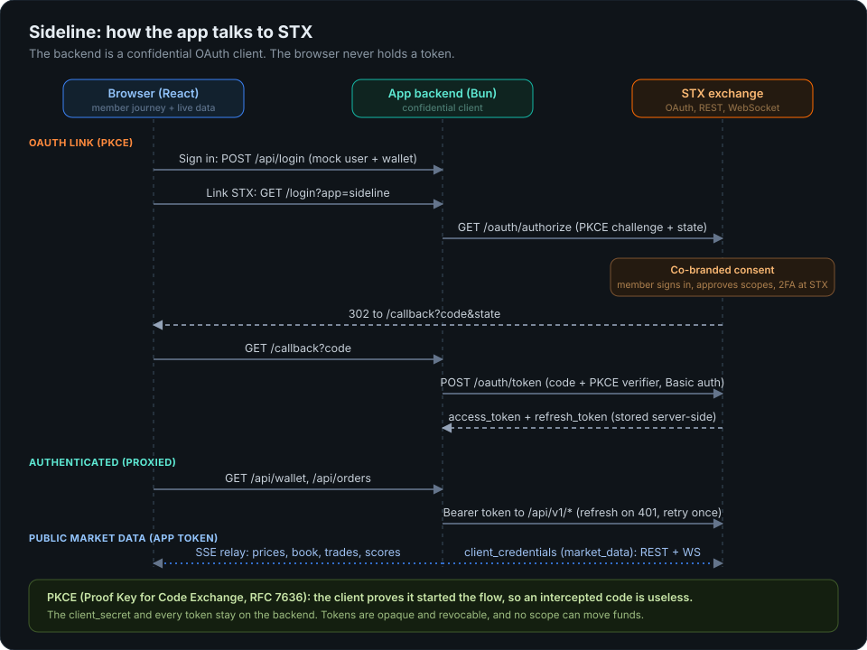

# Sideline: STX sample app

> **Sideline is a fictional sports app used to demonstrate building on STX. It
> is not a real product or company.**

Sideline shows how a partner app (an ISV) integrates with the STX Exchange. It
is a small sports app with its own users and its own wallet, and it:

1. **links a member's STX account** with OAuth 2.0 (authorization code + PKCE),
   run entirely from the app's backend, a confidential client;
2. **acts on the member's behalf with scoped tokens**: reads their balance,
   positions and orders, and places and cancels orders from a betslip;
3. streams **live account data** (balance, orders, fills, positions) from the
   member's STX WebSocket to the browser;
4. reads **public market data** (markets, prices, order books, trades, live
   scores) on the app's own token (`client_credentials`), with no member
   involved;
5. **unlinks and revokes** the grant at STX on request.

Sideline never holds STX funds, no scope can move money, and the browser never
sees an STX token. It is a teaching example: clarity over polish, real code
over hand-waving. Every call the backend makes to STX is listed on the app's
**API calls** page with the SDK call behind it and a redacted request and
response.

## How it fits together

```
 Browser (React)              App backend (Bun)                 STX
 ---------------              -----------------                 ---
 session cookie only  --->    confidential OAuth client  --->   OAuth 2.0
 no STX token                 holds client_secret and           REST /api/v1
                              every STX token                   WebSocket channels
                      <---    SSE: live account + market  <---
```

- The **browser** talks only to the app backend, with an opaque session cookie.
- The **backend** holds the `client_secret` and every STX token. It runs the
  OAuth link flow, calls STX through the STX TypeScript SDK, opens the STX
  sockets, and relays live data to the browser over Server-Sent Events.
- **STX** is the authorization server and the resource server.

The OAuth logic is framework-agnostic; [`docs/oauth-flow.md`](docs/oauth-flow.md)
walks through it step by step so a port to Next.js, Python or Go is obvious.

## Get sandbox access

To run Sideline you need an OAuth client on the STX sandbox exchange (a client
id, a client secret and your redirect URI), plus a sandbox member account to link.

**Get sandbox credentials: sign in to the STX developer console with Google or
GitHub and create an app.** The console is the STX developer console (link
provided with your invite).

1. Sign in with Google or GitHub. Your developer account is created on first
   sign-in.
2. Create an organization, then **Build an app**.
3. Add `http://localhost:8787/callback` (or your deployed `<PUBLIC_URL>/callback`)
   as a redirect URI and pick the member scopes Sideline uses.
4. Creating the app issues its sandbox client. Copy the client id and secret
   right away: the secret is shown once. Rotate it on the app's Credentials tab
   if you lose it.
5. The Credentials tab also shows the sandbox host to use as `STX_BASE_URL`.

## Run it locally

Requirements: [Bun](https://bun.sh) 1.1 or later (or Docker).

```bash
cd node-react
cp .env.example .env      # set STX_BASE_URL, CLIENT_ID, CLIENT_SECRET
```

All configuration comes from the environment; nothing host-specific is built in:

| Env var | What it is |
| ------- | ---------- |
| `STX_BASE_URL` | your STX sandbox host (REST, OAuth, WebSocket) |
| `CLIENT_ID`, `CLIENT_SECRET` | the OAuth client issued to you |
| `REDIRECT_URI` | must exactly match a redirect URI registered on your client; defaults to `http://localhost:8787/callback` in `.env.example` |
| `PUBLIC_URL` | optional: this app's own origin when deployed; `REDIRECT_URI` then defaults to `<PUBLIC_URL>/callback` |
| `STX_PUBLIC_URL` | optional: the exchange as the browser sees it (deposit popup, sport icons); defaults to `STX_BASE_URL` |
| `OAUTH_SCOPES` | scopes requested at `/oauth/authorize` |
| `APP_ID`, `APP_NAME`, `APP_TAGLINE`, `APP_BRAND_COLOR`, `APP_WALLET_CENTS` | optional branding and the app's starting wallet |

Then either:

```bash
docker compose up         # backend :8787, frontend :5173
```

or, without Docker:

```bash
cd node-react/backend && bun install && bun run dev     # backend
cd node-react/frontend && bun install && bun run dev    # frontend, another shell
```

Bun loads `.env` from the working directory, so when running without Docker
copy `node-react/.env` to `node-react/backend/.env` first.

Open <http://localhost:5173>:

1. **Sign in to Sideline** (a mock login with no password: it creates your
   Sideline user and credits your Sideline wallet).
2. Open a game and tap a market. The **betslip** opens. Not linked yet, it
   offers **Link your STX account**: Sideline opens STX in a popup to sign in
   and consent, then exchanges the code for tokens **server-side**.
3. Linked, the betslip places orders on STX and the wallet shows your STX
   balance live, with a chip for each change.
4. **Unlink** from the account panel revokes the grant at STX.

## Using the STX TypeScript SDK

Every call the backend makes to STX goes through the STX TypeScript SDK,
[`@stxapp/stx-typescript`](https://www.npmjs.com/package/@stxapp/stx-typescript)
(0.4.2 or later). The SDK reference is at
<https://docs.stxapp.io/sdks/typescript/>; all the STX SDKs are listed at
<https://docs.stxapp.io/sdks/>. The wiring lives in
[`node-react/backend/src/stx.ts`](node-react/backend/src/stx.ts).

**One OAuth client per app.** The app's credentials go into one `OAuthClient`
from `@stxapp/stx-typescript/oauth`, built once and shared, so token refreshes
are single-flight per member and the app token is minted once:

```ts
import { OAuthClient } from "@stxapp/stx-typescript/oauth";

const oauth = new OAuthClient({
  baseUrl: process.env.STX_BASE_URL,
  clientId: process.env.CLIENT_ID,
  clientSecret: process.env.CLIENT_SECRET,
  redirectUri: process.env.REDIRECT_URI,
  scope: "profile.read balance.read portfolio.read orders.read orders.write",
});
```

The SDK persists state through two small interfaces the app implements over
its own database: a `TokenStore` (a member's tokens, keyed by the app's own
user id) and a `PendingAuthorizationStore` (the PKCE verifier and `state`
between the redirect and the callback). Sideline backs both with SQLite.

**Linking a member** (`GET /login`, `GET /callback` in
[`routes/auth.ts`](node-react/backend/src/routes/auth.ts)):

```ts
// /login: PKCE verifier + S256 challenge + state, stored; redirect to STX.
const { url } = await oauth.beginAuthorization(pendingStore, { data: { userId } });

// /callback: check ?error and state (single use), then exchange the code.
const callback = await readCallback(pendingStore, new URL(request.url));
await oauth.redeemAuthorization(callback, { store: tokens, memberKey: userId });
```

**Acting for the member.** `oauth.memberClient(tokens, userId)` returns an
`STX` client that attaches the member's bearer token, refreshes it before
expiry and once on a `401`, and deletes the stored link when STX refuses the
refresh (a revoked grant):

```ts
const stx = oauth.memberClient(tokens, userId);
await stx.balance();
await stx.placeOrder(marketId, "buy", "limit", { price: "0.40", quantity: "10" });
await stx.cancelOrder(orderId);
await stx.orders();
await stx.fills();
await stx.settlements();
```

**Market data on the app's own token.** `oauth.appClient("market_data")`
returns an `STX` client on a `client_credentials` token, with no member
involved. Sideline uses it for the catalog (`catalog.markets({ status, limit,
cursor })`) and for the public market channels.

**Live data over the WebSocket.** `stx.websocket()` returns an `STXWebSocket`
authenticated as the member (or as the app, on the app client). For the member,
`ws.accountView({ onChange })` joins the balance, orders, fills and positions
topics and keeps one merged view of the account up to date. On the app client,
Sideline joins `ws.ticker()`, `ws.orderbook(ids)`, `ws.trades({ marketIds })`,
`ws.marketStats(ids)` and `ws.market(id)` (live scores). The SDK reconnects and
rejoins after a drop. The backend relays all of it to the browser over
Server-Sent Events, so the browser never opens an STX socket.

**Typed errors.** STX's answers come back as exceptions the app can branch on:

| Error | Raised when | What Sideline does |
| ----- | ----------- | ------------------ |
| `STXException` | STX answered with an error status | forwards STX's status and body to the browser |
| `STXGrantRevokedException` (`/oauth`) | the member's grant is gone (refresh refused) | shows "not linked" so the member can link again |
| `STXOAuthException` (`/oauth`) | the callback carries an OAuth error, or no code or state | ends the link attempt with that error |
| `STXChannelException` | a channel join is refused (for example, a scope the grant lacks) | joins the topics it may and reports the rest |

**Unlinking** is `oauth.unlink(tokens, userId)`: it revokes the grant at STX
and deletes the stored tokens.

The app's **API calls** page shows the SDK call behind every request, so a
running Sideline is also a live map of this section.

## The integration model

- **Sideline has its own wallet**, held in the demo's store (SQLite) and
  separate from any STX balance. Seeded via `APP_WALLET_CENTS`.
- **Account linking.** A Sideline user is created on mock sign-in. Linking runs
  OAuth and stores the STX access and refresh tokens **against that user**, so
  the link survives reconnection. The browser only holds an opaque session
  cookie.
- **Dual wallet.** `Sideline wallet` (held here) + `STX balance` (live from the
  member's STX socket, scope `balance.read`) = `Combined`. A total is shown only
  when the STX cash amount parses.
- **Scoped, money-safe.** Sideline asks only for the scopes it needs
  (`profile.read balance.read portfolio.read orders.read orders.write`). **No
  scope moves money**: deposits and withdrawals are never delegable.
- **Tokens are refreshed server-side.** On expiry or a `401` the backend
  refreshes once and retries; a revoked grant ends the link cleanly.
- **Unlink / revoke.** Unlinking revokes the grant at STX and drops it locally;
  the Sideline user and wallet remain, so they can relink.

## Live sports data

Everything below comes from the exchange itself, through the SDK, on the app's
own token (`client_credentials`, scope `market_data`):

| What | Where it comes from |
| ---- | ------------------- |
| Markets, teams, event status and start | `GET /api/v1/markets` (`participants`, `event_status`, `event_start`, `question`) |
| Sport icons | the exchange's `GET /api/images/categories/standard/<sport>.svg` |
| Live score and clock | the `market:<id>` channel (`ws.market()`, SDK 0.4.2): its join reply and `market_update` carry `event_brief`, e.g. `CHC 3 - 4 BOS : Bottom 8th 1 Outs` |
| Prices, book, trades, price history | `ticker`, `orderbook`, `trades`, `market_stats` channels |

The backend joins `market:<id>` for one market per live game (and each betslip
market), at most 12 per stream, and relays only the event status to the browser
as `brief` events (`GET /api/market-stream?topic=market`).

Teams are shown as badges of their abbreviation in a colour of their own: the
exchange serves no team or league logos (see Known limitations), and the demo loads
no images from third parties.

## Architecture



- **Backend** (`node-react/backend`, Bun + Hono): holds the app's
  `client_secret` and every STX token, brokers the OAuth link flow, keeps the
  app's mock wallet, proxies member calls through the SDK, holds the STX sockets
  (the member's account view and the public market channels) and relays them
  to the browser over SSE, and logs every STX call. Persistence is **SQLite**
  behind swappable store interfaces (`src/stores.ts`).
- **Frontend** (`node-react/frontend`, Vite + React): markets and scores, the
  betslip, the dual wallet, the member's orders, trades and settlements, and
  the API calls page. The browser opens no STX socket and holds no credential.

### Store schema (`backend/src/stores.ts` over `backend/src/db.ts`)

| Table           | Keyed by            | What it holds |
| --------------- | ------------------- | ------------- |
| `users`         | `(session_id, app_id)` unique | the mock app user and their own `wallet_cents`. One per browser session. |
| `account_links` | `user_id`           | the STX grant linked to a user: tokens, granted scopes, `linked_at`. The only place STX tokens live. |
| `auth_flows`    | `state` (one-time)  | transient PKCE verifier and which app and user the grant links to. |
| `activity`      | autoincrement       | every STX request, with the SDK call and its redacted request and response. |

### Backend routes

| Route | Purpose |
| ----- | ------- |
| `GET /api/app` | the app profile (no secrets) and the exchange's public URL |
| `GET /api/me` | the app, signed-in user (and wallet), link status |
| `POST /api/login` | mock sign-in (creates user and wallet) |
| `POST /api/signout` | sign out (revoke and drop the link, remove the user) |
| `POST /api/unlink` | unlink STX (revoke and drop the grant), keep the user |
| `GET /api/wallet` | dual wallet: app wallet, STX balance, combined |
| `GET /api/orders`, `POST /api/orders`, `POST /api/orders/batch`, `DELETE /api/orders/:id` | order proxies |
| `GET /api/trades`, `GET /api/settlements` | the member's fills and settled positions |
| `GET /api/stream` | SSE: the member's live account (balance, orders, fills, positions) |
| `GET /api/markets` | the public market catalog |
| `GET /api/market-stream?topic=` | SSE: `ticker`, `orderbook`, `trades`, `market_stats`, or `market` (live scores) |
| `GET /api/activity`, `GET /api/activity/:id/detail` | the API calls log and one call's redacted detail |
| `GET /login`, `GET /callback` | the OAuth account-linking flow |

## Known limitations

Things the demo works around because the exchange does not offer them to apps today:

- **No team or league logos.** The exchange has no logo field on events,
  markets or participants and serves no team images; only per-sport icons
  (`/api/images/categories/...`). Teams are shown as abbreviation badges.
- **No structured score.** A live score exists only as preformatted text
  (`event_brief` / `detailed_event_brief`); home and away scores, period and
  clock are not separate fields on any external surface. The demo parses
  `"AWAY n - m HOME : clock"` and falls back to the text as-is.
- **No score over REST.** `GET /api/v1/markets` omits `event_brief`, there is no
  `GET /api/v1/events/:id`, and `GET /api/v1/events` (scope `events`) carries no
  brief or score. Scores are reachable only on the market channels
  (`market:<id>`, `markets`, `market_updates`, `market_info`), which an app
  token with `market_data` may join; the demo uses `market:<id>`.
- **No initial brief on the list channels.** `markets` and `market_updates`
  send only changes, and `market_info`'s full snapshot is about 10 MB, so the
  demo joins `market:<id>` per live game to get the current score on join.
- **The `events` channel carries volume only** and needs the `events` scope.

## Tests

```bash
cd node-react/backend && bun install && bun test && bunx tsc --noEmit
cd node-react/frontend && bun install && bunx tsc --noEmit && bun run build
```

The backend tests need no network or STX account: they run the OAuth flow,
token refresh, revoke and the activity log's redaction against a stubbed
exchange.

## Repo layout

```
stx-isv-demo/
  README.md
  LICENSE
  docs/oauth-flow.md          # stack-agnostic flow: authorize, consent, callback, token, refresh, revoke
  docs/architecture.svg
  node-react/
    .env.example
    docker-compose.yml        # backend + frontend (+ commented-out Postgres alternative)
    Dockerfile                # single-container image: backend serving the built frontend
    backend/                  # Bun + TypeScript: confidential OAuth client, wallets, linking, SDK
    frontend/                 # Vite + React: markets, scores, betslip, wallet, API calls
```

## License

MIT. See [LICENSE](LICENSE).
