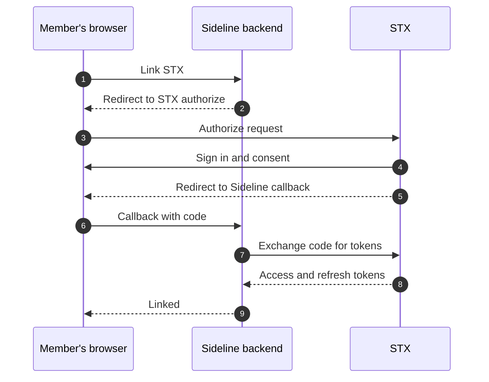
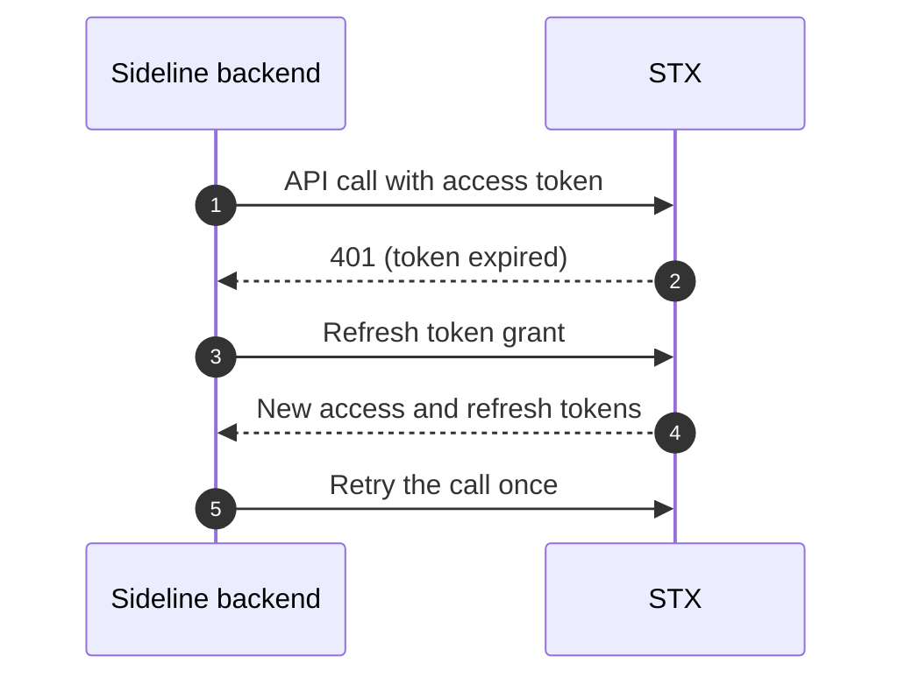
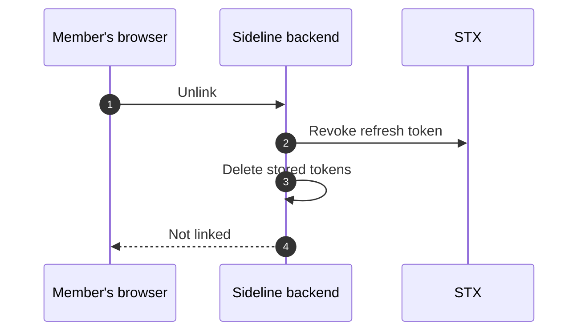
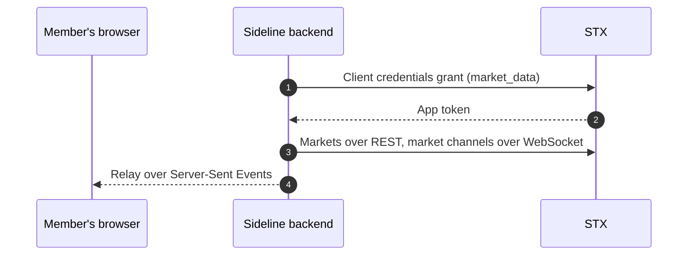
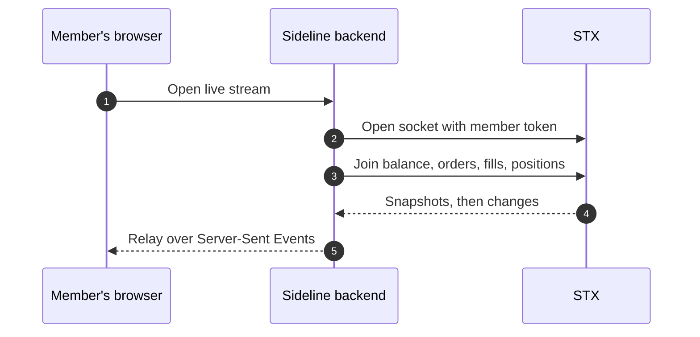

# How Sideline links an STX account

Sideline links a member's STX account with OAuth 2.0 (authorization code +
PKCE), acts for them with scoped tokens, and reads public market data on its own
token. This page walks through each part with the matching
[`@stxapp/stx-typescript`](https://docs.stxapp.io/sdks/typescript/) call. The
steps are plain HTTP, so they port to any stack.

## Roles

- **Member's browser**: holds only a Sideline session cookie, never an STX token.
- **Sideline backend**: a *confidential* OAuth client. It keeps the
  `client_secret` and every STX token, and makes every call to STX.
- **STX**: the authorization server (`/oauth/*`) and the API (`/api/v1/*`,
  WebSocket at `/socket`).

When an app is registered with STX it gets a `client_id`, a `client_secret`,
its exact redirect URIs (no wildcards) and the scopes it may request. Sideline
asks for `profile.read balance.read portfolio.read orders.read orders.write`.
**No scope moves money**: deposits and withdrawals are never delegable.

In the SDK, the app is one `OAuthClient` built from those credentials. The app
supplies two small stores over its own database: a `PendingAuthorizationStore`
(PKCE verifier and state between the redirect and the callback) and a
`TokenStore` (each member's tokens, keyed by the app's own user id).

## Linking an account

1. The member, already signed in to Sideline, taps **Link your STX account**.
2. The backend makes a PKCE verifier and its S256 challenge, plus a single-use
   `state`, stores them, and redirects the browser to `/oauth/authorize` with
   `response_type=code`, `client_id`, `redirect_uri`, `scope`, the challenge
   and `state`.
   SDK: `oauth.beginAuthorization(pendingStore, { data })` returns the `url`.
3. The browser opens STX's authorize page.
4. STX signs the member in and shows a consent screen naming the app and the
   scopes. The member approves.
5. STX redirects to the app's `redirect_uri` with `code` and `state` (or an
   `error`).
6. The backend checks `state` against the flow it started and consumes it, so
   a replayed or forged callback fails.
   SDK: `readCallback(pendingStore, callbackUrl)`, which throws
   `STXOAuthException` on an error or a bad state.
7. The backend POSTs to `/oauth/token` with `grant_type=authorization_code`,
   the `code`, the same `redirect_uri` and the PKCE verifier, authenticated
   with HTTP Basic (`client_id:client_secret`).
8. STX returns `access_token`, `refresh_token`, `expires_in` and `scope`. The
   backend stores them against the Sideline user.
   SDK (7 and 8): `oauth.redeemAuthorization(callback, { store: tokens, memberKey })`.
9. The backend sends the browser back to the app, now linked.

PKCE means a code intercepted on the redirect is useless without the verifier,
which never leaves the backend.

## Calling STX for the member

`oauth.memberClient(tokens, memberKey)` returns an `STX` client that sends
`Authorization: Bearer <access_token>` on every call, for example
`stx.balance()`, `stx.placeOrder(...)`, `stx.cancelOrder(id)`,
`stx.orders()`, `stx.fills()` and `stx.settlements()`. Request and response
formats are in the [API reference](https://docs.stxapp.io/).

## Refresh

1. The backend calls STX with the member's access token, which has expired.
   (The SDK also refreshes shortly before expiry, without waiting for a `401`.)
2. STX answers `401`.
3. The backend POSTs `grant_type=refresh_token` with the current refresh token,
   authenticated with HTTP Basic.
4. STX **rotates** the refresh token: it returns a new pair and the old refresh
   token stops working. The backend stores the new pair.
5. The backend retries the original call once.

The SDK does all of this inside `memberClient`, once per member even when
several calls fail together. Presenting an old refresh token is treated as
theft and revokes the whole grant. If STX refuses the refresh, the SDK deletes
the stored tokens and throws `STXGrantRevokedException`; Sideline then shows the
member as not linked.

## Unlinking

1. The member taps **Unlink**.
2. The backend POSTs the refresh token to `/oauth/revoke` (RFC 7009) with HTTP
   Basic. Revoking the refresh token ends the whole grant at once.
3. The backend deletes its copy of the tokens, whether or not STX answered.
   The Sideline user and wallet stay, so the member can link again.
4. The browser shows the account as not linked.

SDK: `oauth.unlink(tokens, memberKey)`. STX tokens are opaque and checked on
every call, so revocation takes effect on the next request.

## Market data on the app's own token

1. The backend mints an app token with `grant_type=client_credentials` and
   scope `market_data`, authenticated with HTTP Basic. No member is involved.
2. STX returns the app token.
3. The backend reads markets with `GET /api/v1/markets` and joins the public
   channels (`ticker`, `orderbook`, `trades`, `market_stats`, and
   `market:<id>` for live scores) on a socket authenticated with that token.
4. It relays what it receives to the browser over Server-Sent Events.

SDK: `oauth.appClient("market_data")` returns an `STX` client that mints and
reuses the app token: `catalog.markets(...)`, then `catalog.websocket()` and
`ws.ticker()`, `ws.orderbook(ids)`, `ws.trades(...)`, `ws.marketStats(ids)`,
`ws.market(id)`.

## The member's live data

1. The browser opens `GET /api/stream` on the Sideline backend.
2. The backend opens an STX socket with the member's access token in the
   `x-stx-oauth-token` header. Browsers cannot set WebSocket headers, and must
   not hold the token anyway, so the socket lives on the backend.
3. It joins the member's `balances`, `orders`, `fills` and `positions` topics.
   Each join needs its scope; a topic the grant does not cover is refused on
   its own and the rest still stream.
4. STX sends a snapshot on join, then every change.
5. The backend relays each change to the browser.

SDK: `stx.websocket()` on the member client, then `ws.accountView({ onChange })`,
which joins the four topics and keeps one merged view of the account. A refused
join throws `STXChannelException`. The SDK reconnects and rejoins after a drop.

## More

- TypeScript SDK reference: <https://docs.stxapp.io/sdks/typescript/>
- All STX SDKs: <https://docs.stxapp.io/sdks/>
- Sideline's SDK wiring: [`node-react/backend/src/stx.ts`](../node-react/backend/src/stx.ts)
